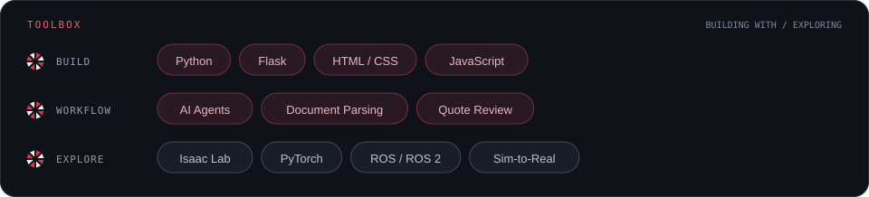
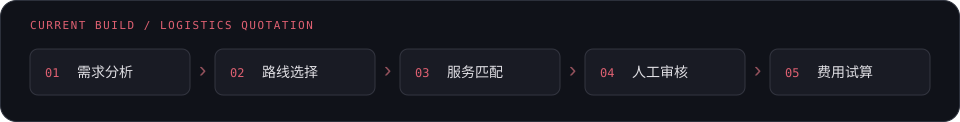
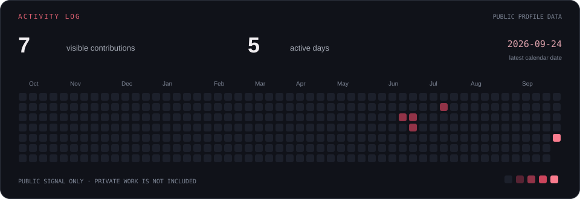
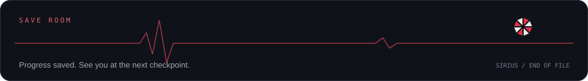

  

  <b>你好，我是 Sirius 🍞</b> 
  把复杂的业务流程做成能用的工具，也在探索机器人如何感知、学习和行动。

  <a href="#-mission-files">项目档案</a> ·
  <a href="#-field-guide">技术与工作说明</a> ·
  <a href="#-activity-log">活动记录</a>

## ☂ Mission files

### 01 / 物流报价智能体

我在开发面向 B2B 物流报价的工具，把**需求分析、路线选择、供应商与服务匹配、人工审核和费用试算**串联起来。工作重点是让报价信息能够被整理、复核和追溯，让多步骤业务流程在网页中完成。

### 02 / 报价单抽取与数据库管理

处理 Excel、PDF、Word 等格式的报价文件，将**运输运费和服务费规则分开整理**；提供人工修改、草稿保存、审核入库、有效期管理与来源查询。也在完善费用计算、报价修订和操作界面，让原始文件与结构化数据衔接起来。

以上为私有项目的功能概述；代码、业务数据和内部文档不公开。

### 03 / 机器人学习档案

我的公开仓库目前主要是机器人方向的 Fork，覆盖强化学习训练、运动控制与仿真部署，用来整理和探索这一套技术链路。

| 仓库 | 方向 | 上游来源 |
| :--- | :--- | :--- |
| [**robot_lab ↗**](https://github.com/Sirius-yibai1002/robot_lab) | 基于 Isaac Lab 的机器人强化学习环境 | [fan-ziqi/robot_lab](https://github.com/fan-ziqi/robot_lab) |
| [**HIMLoco ↗**](https://github.com/Sirius-yibai1002/HIMLoco) | 基于学习的运动控制、Hybrid Internal Model | [InternRobotics/HIMLoco](https://github.com/InternRobotics/HIMLoco) |
| [**rl_sar ↗**](https://github.com/Sirius-yibai1002/rl_sar) | 强化学习策略的仿真验证与真机部署框架 | [fan-ziqi/rl_sar](https://github.com/fan-ziqi/rl_sar) |

这里列出的是所关注项目的方向；原始框架与算法成果归上游作者所有。

## ☂ Field guide

<b>打开工具档案 · 这些技术分别用在哪里？</b>

 

| 分区 | 工具与用途 |
| :--- | :--- |
| **应用开发** | **Python / Flask**：后端服务、文件处理与业务流程；**HTML / CSS / JavaScript**：网页交互与审核界面。 |
| **文档处理** | **openpyxl / xlrd**：Excel 报价表；**pdfplumber**：PDF 内容提取；**python-docx**：Word 文档解析。 |
| **报价工作流** | 将需求解析、路线匹配、供应商服务选择和费用试算衔接起来，保留人工审核与原文追溯。 |
| **机器人探索** | 通过公开 Fork 关注 **Isaac Lab、PyTorch、ROS / ROS 2** 以及从仿真到真实机器人的策略部署流程。 |

开发工具和探索中的技术分开列出；技术标签不表示已经完成所有框架的项目落地。

## ☂ Activity log

根据公开贡献日历自动生成。私有项目的开发量不会完整反映在这张图中。

 

Resident Evil inspired · Unofficial fan theme · Built for Sirius

